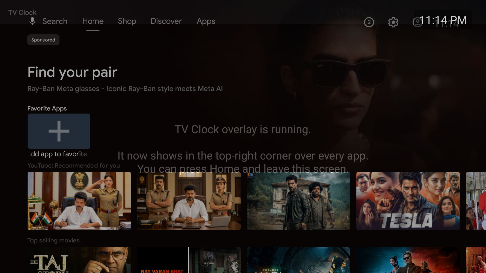

# TV Clock — always-on overlay for Android TV / Google TV

A tiny Android TV app that pins the current time to the **top-right corner of the screen, on top of every other app** — launcher, YouTube, Netflix, anything. Built for personal use on a real TV (sideloaded, not a Play Store app).

**[⬇️ Download the APK](https://github.com/tatavarthitarun/tv-overlay-clock/releases/latest)** &nbsp;·&nbsp; **[📖 Illustrated explainer](https://tatavarthitarun.github.io/tv-overlay-clock/EXPLAINER.html)**



*Verified on a Google TV emulator: the `9:41`-style clock renders over the launcher's content rows.*

## How it works

A normal app can only draw inside its own window, so it vanishes the moment you switch apps. The only way to float over everything is a **system overlay window**: the app hands a `TextView` to the `WindowManager` as `TYPE_APPLICATION_OVERLAY`, pinned `TOP | END`, refreshed every second. It's owned by a **foreground service** (not an Activity) so it survives app-switching, plus a `BootReceiver` restarts it after the TV reboots.

| File | Role |
|------|------|
| `MainActivity.kt` | Launcher tile — checks the overlay permission and starts the service. |
| `ClockOverlayService.kt` | Foreground service that adds the clock to the `WindowManager` and ticks every second. |
| `BootReceiver.kt` | Restarts the overlay on `BOOT_COMPLETED`. |

Written in Kotlin, zero third-party dependencies. Android TV / Google TV run the same runtime as phones, so there's no Java-only restriction.

- **Stack:** Kotlin 1.9.24 · AGP 8.7.2 · Gradle 8.9 · JDK 21
- **SDK:** minSdk 21 · targetSdk 33 · compileSdk 34

## Build

Requires JDK 17–21 (the Android Gradle Plugin does not support JDK 23+) and the Android SDK. Point Gradle at your SDK via `ANDROID_HOME` or a `local.properties` file with `sdk.dir=/path/to/Android/sdk`.

```bash
JAVA_HOME=/path/to/jdk-21 ./gradlew assembleDebug
# → app/build/outputs/apk/debug/app-debug.apk
```

## Install on your TV

Enable **Developer options → USB/Network debugging** on the TV, then:

```bash
./deploy.sh 192.168.1.50    # your TV's IP — connect + install + grant + launch
```

Or manually:

```bash
adb connect 192.168.1.50:5555
adb install -r app/build/outputs/apk/debug/app-debug.apk
adb shell appops set com.tatav.tvclock SYSTEM_ALERT_WINDOW allow   # the key step
adb shell am start -n com.tatav.tvclock/.MainActivity
```

> **Why the `appops` command?** Android TV usually has no on-screen setting for "Draw over other apps", so the normal permission dialog never appears. Granting `SYSTEM_ALERT_WINDOW` over ADB is the reliable way. Without it, the app runs but shows no clock.

## Try it on an emulator

```bash
echo no | $ANDROID_HOME/cmdline-tools/latest/bin/avdmanager create avd \
  -n tv_clock -k "system-images;android-34;android-tv;arm64-v8a" -d tv_1080p
$ANDROID_HOME/emulator/emulator -avd tv_clock -gpu auto &
./deploy.sh
```

## Customize

All in `app/src/main/java/com/tatav/tvclock/ClockOverlayService.kt`:

- **24-hour time:** change the format `"h:mm a"` → `"HH:mm"`.
- **Position / size / colour:** tweak `params.x/y`, `setTextSize`, `setBackgroundColor`.

## Notes

- **DRM video:** some streaming apps mark their surface "secure"; the system may hide *all* overlays during protected playback, so the clock can briefly disappear there. Everywhere else it stays.
- Debug-signed sideload for personal use — not intended for the Play Store.

## Download

Grab the ready-to-sideload APK from the [**latest release**](https://github.com/tatavarthitarun/tv-overlay-clock/releases/latest), or read the full illustrated walkthrough at the [**live explainer**](https://tatavarthitarun.github.io/tv-overlay-clock/EXPLAINER.html) (also in this repo as [`EXPLAINER.html`](EXPLAINER.html)).

## License

MIT — see [LICENSE](LICENSE).

---

<div align="center">

*Built with ❤️🎈 — "Build with heart. Rise with purpose."*

**— ❤️🎈**

</div>
